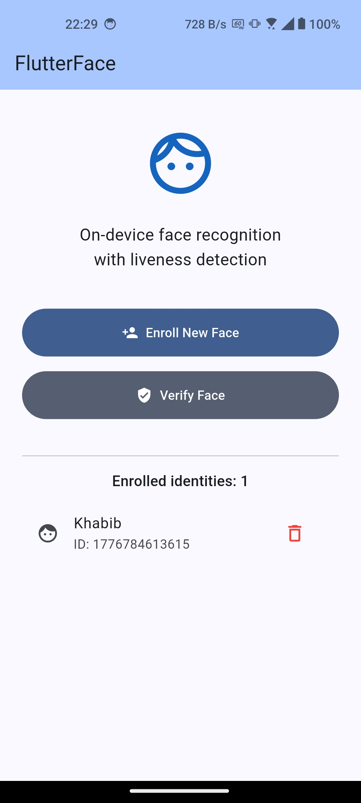
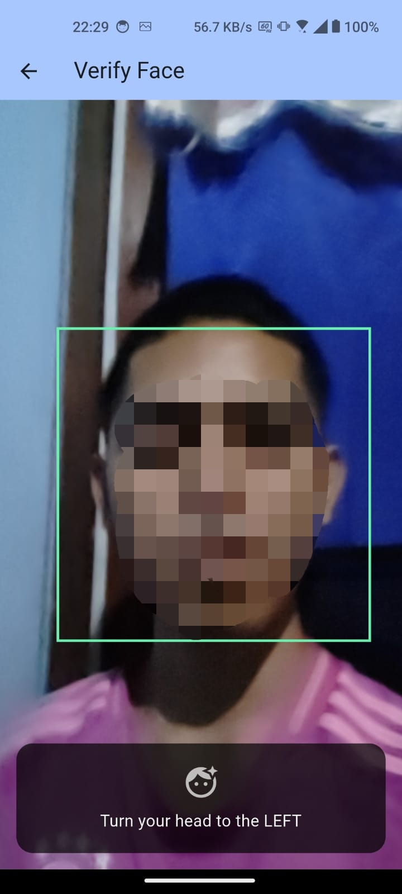
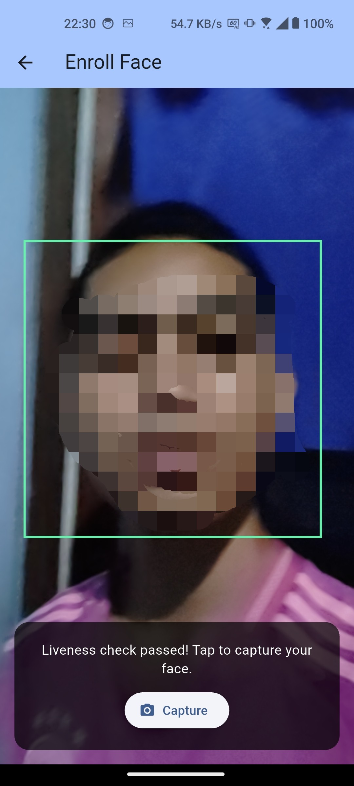
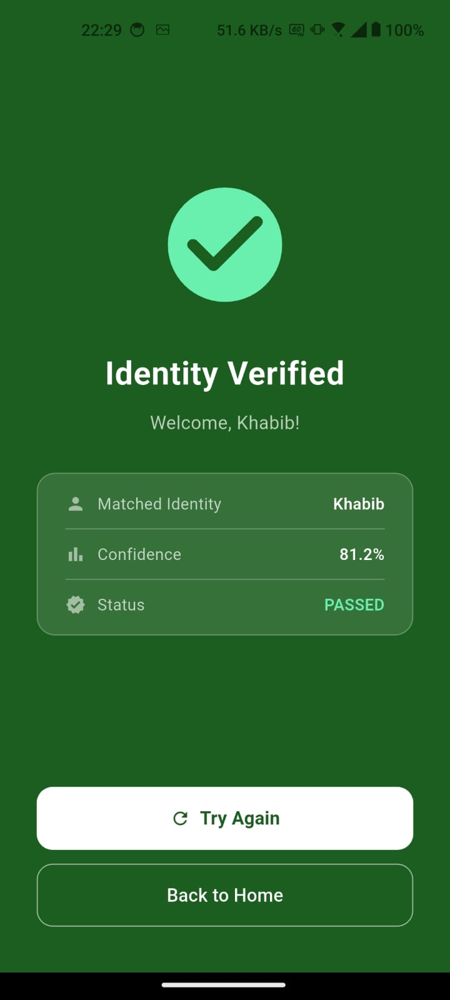

# FlutterFace

A production-ready, fully **on-device** face recognition app built with Flutter. No cloud API calls — all face detection, liveness checking, embedding extraction, and identity matching happen entirely on the device.

---

## Screenshots

| Home | Liveness Check | Enroll | Verified |
|:----:|:--------------:|:------:|:--------:|
|  |  |  |  |

---

## Features

- **Live face detection** — real-time bounding box overlay using Google ML Kit
- **Liveness detection** — randomised challenges (blink + head turn) to prevent spoofing with photos or videos
- **Centering confirmation** — after challenges pass, requires a frontal face before proceeding, ensuring a clean embedding
- **Face enrollment** — capture and securely store a face embedding with a name/ID
- **Face verification** — match a live face against enrolled identities using cosine similarity
- **Encrypted local storage** — embeddings are stored with AES-256 via `flutter_secure_storage`; no data leaves the device
- **Full-screen result screen** — animated pass/fail result with confidence score
- **Android & iOS support** — handles YUV420, NV21 (Android), and BGRA8888 (iOS) camera formats

---

## How It Works

### 1. Liveness Detection
Before any face is enrolled or verified, the user must complete **2 randomised challenges** from:
- **Blink** — detected via an open→closed eye probability transition
- **Turn Left / Turn Right** — detected via `headEulerAngleY` with front-camera mirroring correction

After all challenges pass, the user must return their face to a frontal position (within ±12°) for 5 consecutive frames before the check is considered complete.

### 2. Face Enrollment
1. Pass liveness check
2. Tap **Capture** — a single frame is grabbed and the face region is cropped, resized to the model's input size, and normalised
3. A TFLite face embedding model runs inference on-device, producing an L2-normalised embedding vector
4. Enter a name/ID — the embedding is stored encrypted on the device

### 3. Face Verification
1. Pass liveness check
2. A frame is captured automatically and an embedding is extracted
3. Cosine similarity is computed against all enrolled embeddings
4. The best match above the threshold (default: 65%) is declared a pass

---

## Architecture

```
lib/
├── main.dart                         # App entry, permission request, FaceStore provider
├── modules/
│   ├── face_camera/
│   │   ├── face_camera_controller.dart   # Camera + ML Kit face detection
│   │   └── face_camera_preview.dart      # Live preview with bounding box overlay
│   ├── face_liveness/
│   │   └── face_liveness_controller.dart # Challenge orchestration state machine
│   ├── face_embedder/
│   │   └── face_embedder.dart            # TFLite inference, crop/resize, L2 normalise
│   └── face_store/
│       └── face_store.dart               # Encrypted storage, cosine similarity matching
└── screens/
    ├── enrollment_screen.dart            # Liveness → capture → label → save flow
    ├── verification_screen.dart          # Liveness → match flow
    └── verification_result_screen.dart   # Full-screen animated pass/fail result
```

---

## Tech Stack

| Package | Purpose |
|---|---|
| `camera ^0.11.0+2` | Live camera feed, raw frame access |
| `google_mlkit_face_detection ^0.12.0` | Face bounding boxes, landmarks, eye/head angles |
| `tflite_flutter ^0.11.0` | On-device TFLite model inference |
| `image ^4.2.0` | Face crop and resize |
| `flutter_secure_storage ^9.2.2` | AES-256 encrypted local storage |
| `provider ^6.1.2` | State management |
| `permission_handler ^11.3.1` | Camera permission request |

---

## Setup

### 1. Clone and install dependencies
```bash
git clone <repo-url>
cd face_detection_app
flutter pub get
```

### 2. Add a TFLite face embedding model

Place your TFLite model at:
```
assets/models/mobilefacenet.tflite
```

A compatible model (FaceNet-style) can be sourced from:
[github.com/MCarlomagno/FaceRecognitionAuth](https://github.com/MCarlomagno/FaceRecognitionAuth)

The app automatically reads the model's input/output tensor shapes at load time — no code changes needed for different model sizes (112×112, 160×160, 128-dim, 192-dim, etc.).

### 3. Run

```bash
flutter run
```

**Minimum requirements:**
- Android: minSdkVersion 21
- iOS: 13.0+

---

## Configuration

To tune matching sensitivity, change `matchThreshold` in `face_store.dart` (default: `0.65`):

```dart
FaceStore(matchThreshold: 0.70) // stricter matching
```

---

## Privacy

All biometric data is processed and stored **entirely on-device**. No embeddings, images, or personal data are transmitted to any server. Enrolled embeddings are encrypted at rest using the platform's secure storage (Android Keystore / iOS Secure Enclave).

